# Power BI Projects
<!--   -->

--------------------

0 Gather requirements

1 Import data to Power BI

2 Edit Data in Power Query Editor

3 Create Columns & measures

4 Create Visuals

5 Format Dashboard Background

6 Format Visuals

7 Publish

-------------------
## Competitor Sales Analysis in Power BI
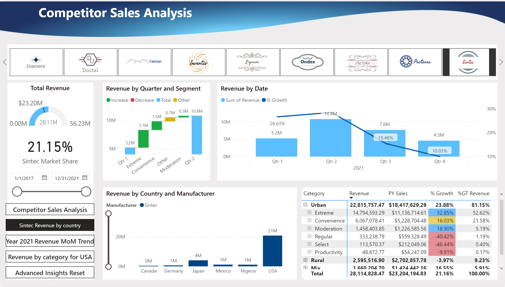
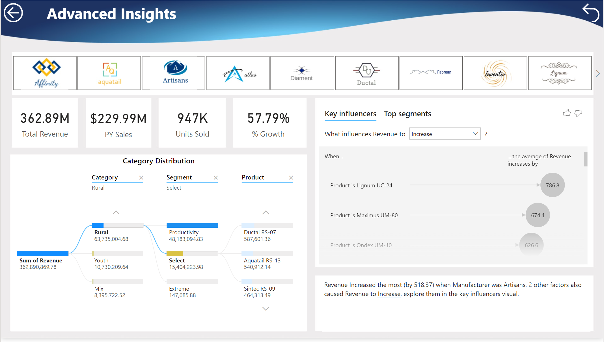

## Power BI Dashboard for REAL Estate and Property Management

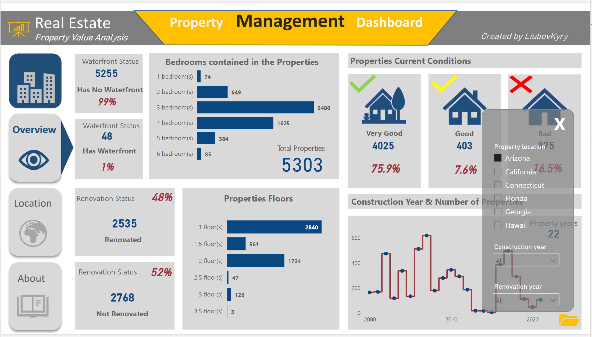
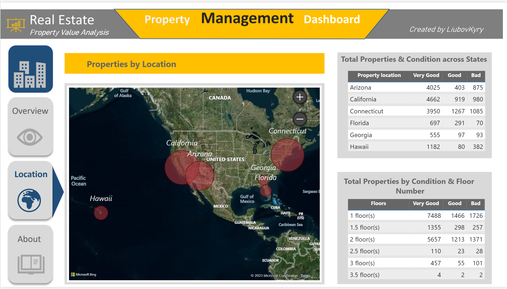
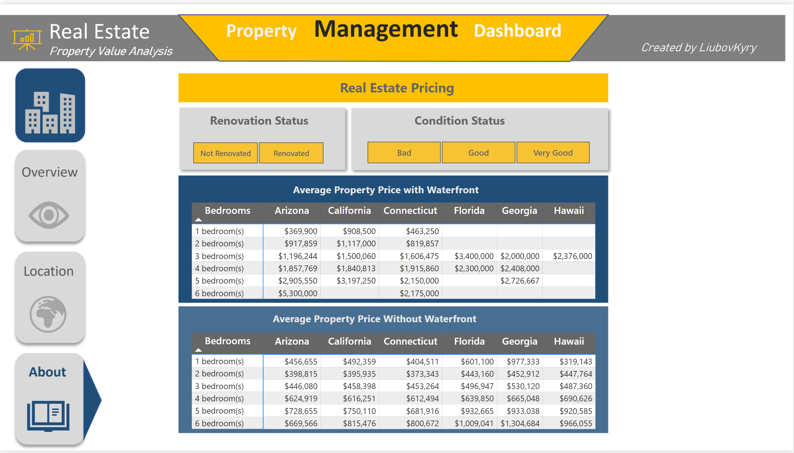

## HR Analytics in Power BI

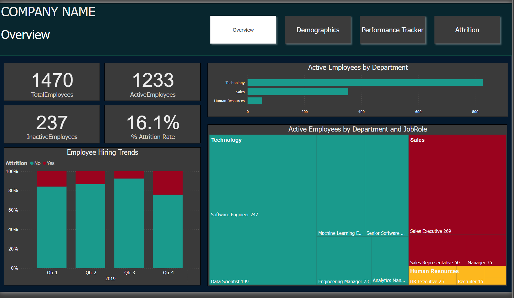
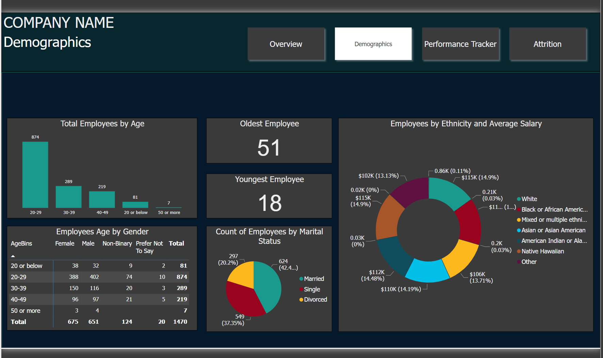
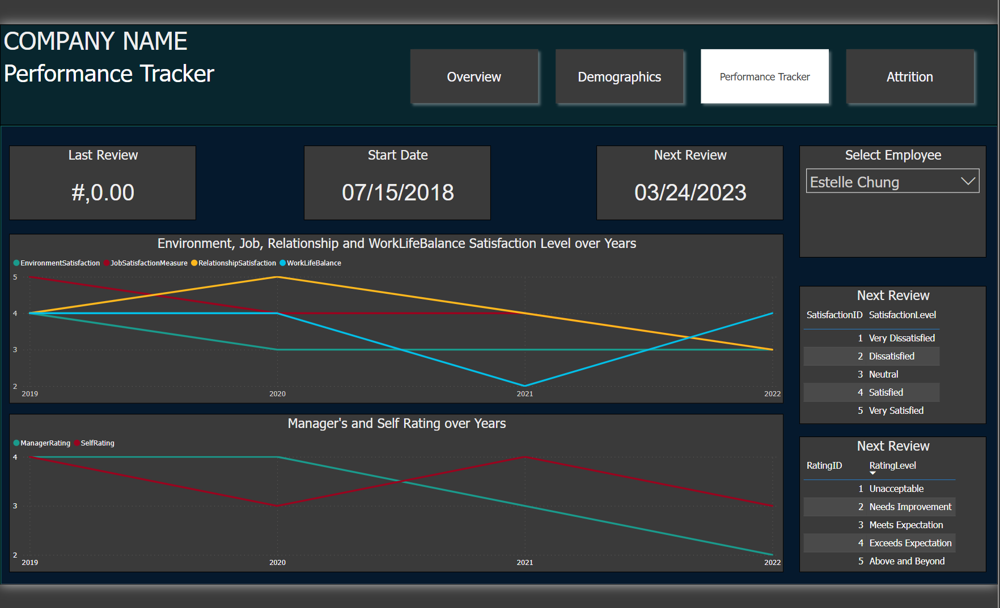
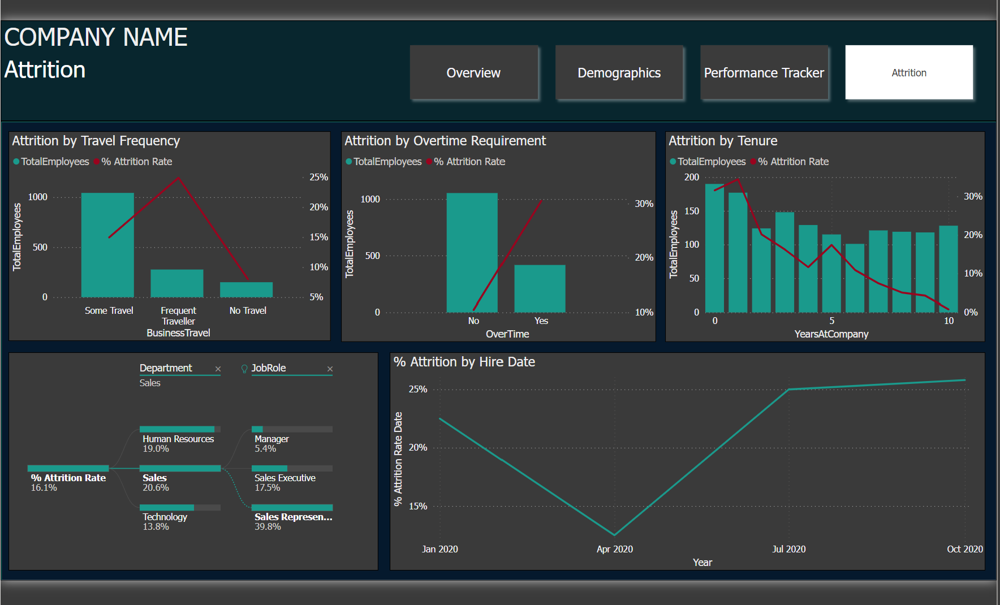

## Sales Distribution Dashboard in Power BI 

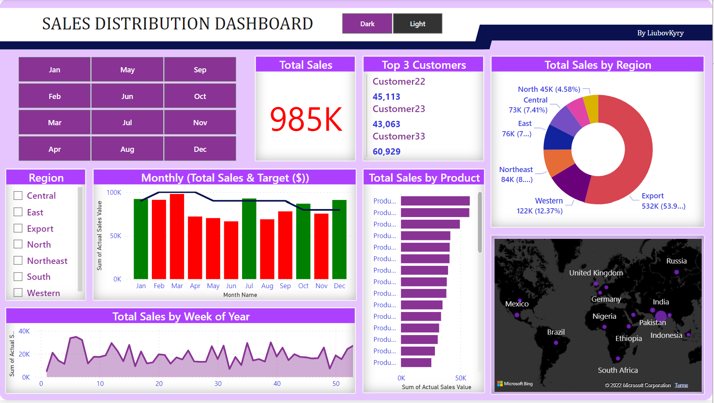
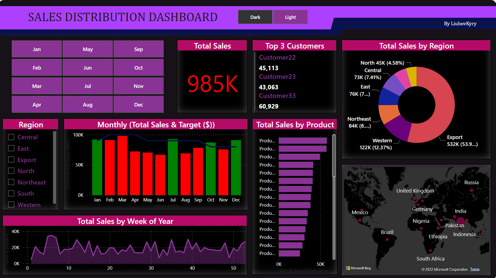

## Report in Power BI

#### 1 - Report Headline
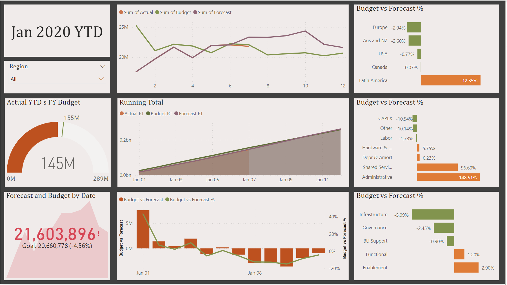
#### 2 - Report Regional
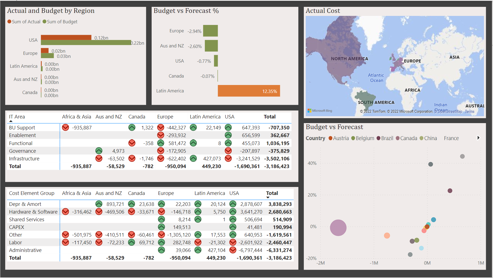
#### 3 - Decomposition Tree
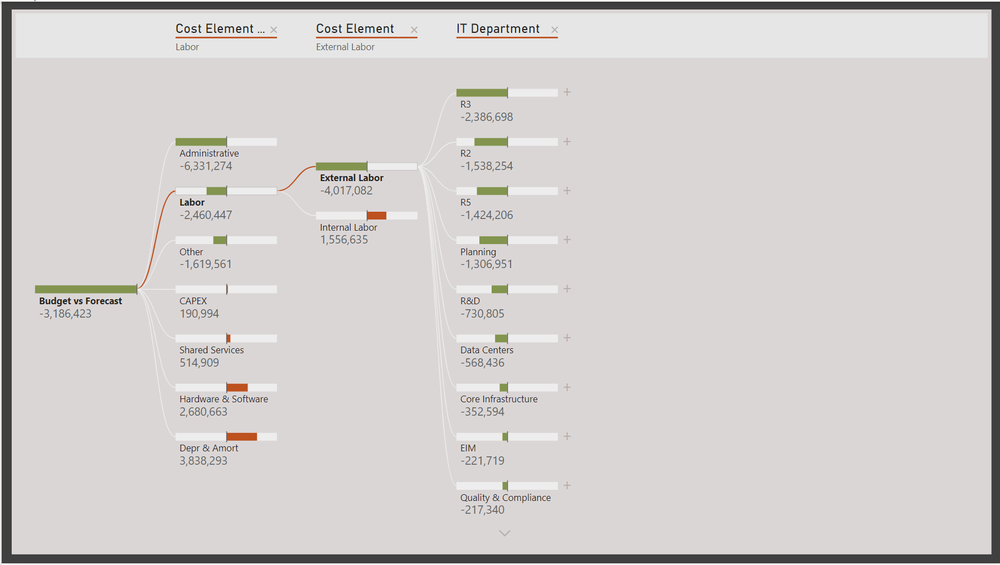

## Sales Dashboard

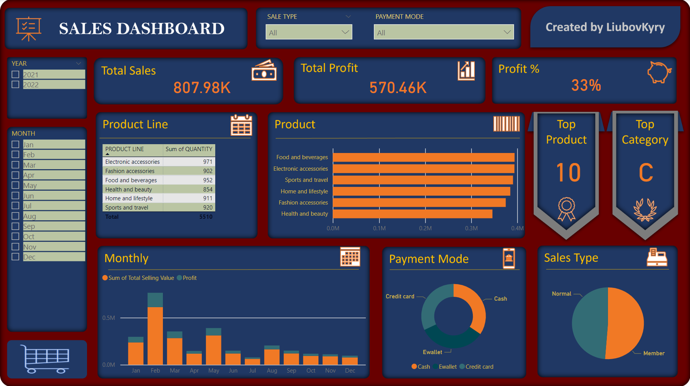

## Customer Analytics Dashboard in Power BI

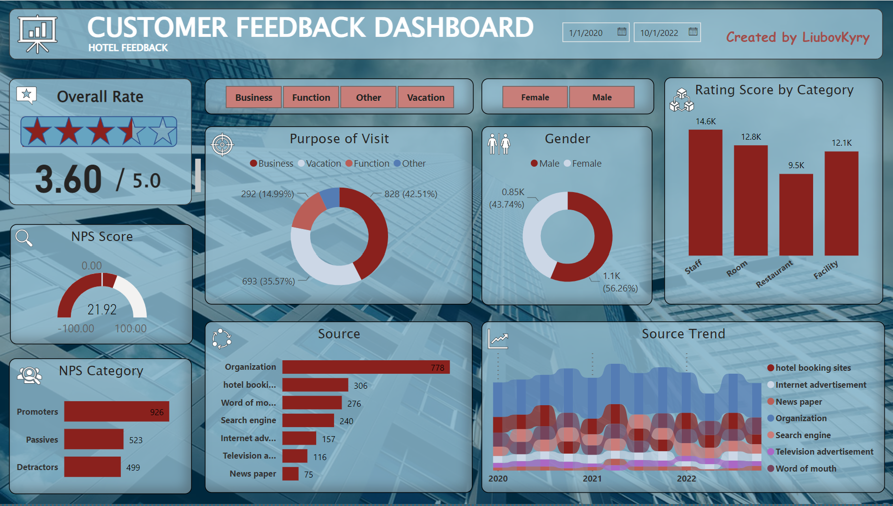

## Power BI Reports - Non-Financial Data Analysis
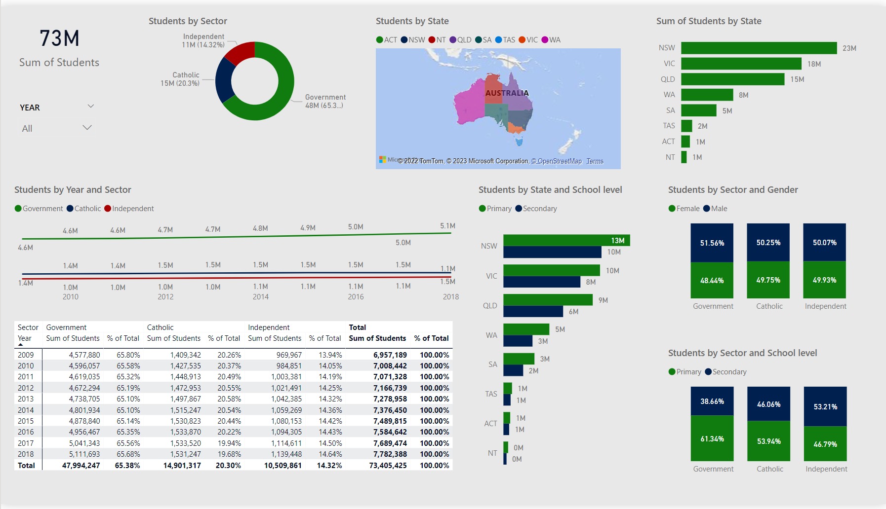

