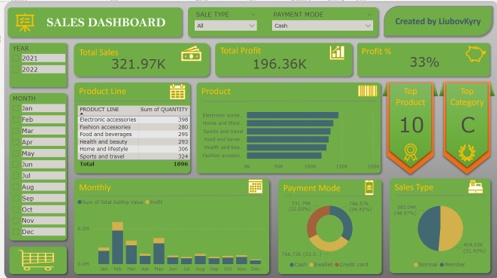

# PowerBIprojects

--------------------

0 Gather requirements

1 Import data to Power BI

2 Edit Data in Power Query Editor

3 Create Columns & measures

4 Create Visuals

5 Format Dashboard Background

6 Format Visuals

7 Publish

-------------------

## HR Analytics in Power BI

https://app.datacamp.com/learn/courses/case-study-hr-analytics-in-power-bi

## Sales Distribution Dashboard in Power BI | Power BI Dashboard

https://www.youtube.com/watch?v=C-Cvaqmchq0

https://leanexcelsolutions.com/sales-distribution-dashboard-in-excel-and-power-bi/

## Customer Analytics Dashboard in Power BI
https://leanexcelsolutions.com/customer-analytics-dashboard-in-power-bi/
#### 1 - Report Headline

#### 2 - Report Regional

#### 3 - Decomposition Tree

## Sales Dashboard

https://leanexcelsolutions.com/sales-dashboard-in-excel-power-bi/

https://www.youtube.com/watch?v=CGgXHsD19Ek&t=93s

<!--   -->

## Customer Analytics Dashboard in Power BI
https://leanexcelsolutions.com/customer-analytics-dashboard-in-power-bi/

