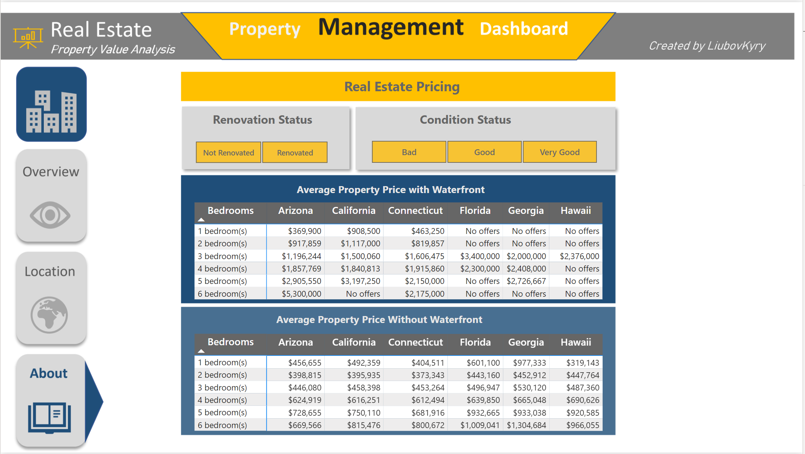

# Power BI

## Project steps:

0 Gather requirements

1 Import data to Power BI

2 Edit Data in Power Query Editor

3 Create Columns & measures

4 Create Visuals

5 Format Dashboard Background

6 Format Visuals

7 Publish

-------------------

## Report for Waggle (udacity project)

## Competitor Sales Analysis in Power BI

## Power BI Dashboard for REAL Estate and Property Management

## HR Analytics in Power BI

## Sales Distribution Dashboard in Power BI 

## Report in Power BI

#### 1 - Report Headline

#### 2 - Report Regional

#### 3 - Decomposition Tree

## Flight Delays

## Sales Dashboard

## Customer Analytics Dashboard in Power BI

## Power BI Reports - Non-Financial Data Analysis

##  Data Model for Seven Sages Brewing Company

### Sales and GPM Overview - Page 1

### Gross Profit and Units Sales - Page 2

### Products comparison - Page 3

### Seasonality - Page 4

